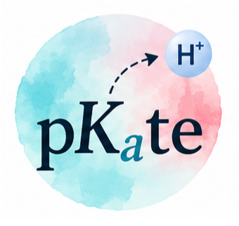
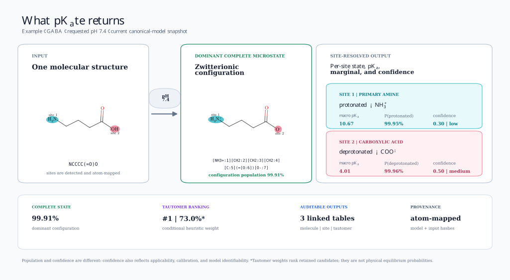

<h1 align="center">
  
</h1>

[](https://github.com/k-zator/protonator/actions/workflows/tests.yml)
[](https://codecov.io/gh/k-zator/protonator)
[](environment.yml)
[](LICENSE)

<!-- The visible project name is pKₐte. The temporary GitHub slug remains
     k-zator/protonator; update badge, clone, and coverage URLs after migration. -->

An atom-mapped, provenance-aware pipeline for predicting molecular
protonation microstates, site protonation probabilities, and pKa behavior in
multisite molecules.

**Full documentation:** Read the
[scientific pipeline guide](scripts/CANONICAL_PIPELINE_GUIDE.md) for the
complete Stage 1–3 methodology, assumptions, schemas, provenance rules,
training and inference workflows, output interpretation, and limitations.

## One prediction, at a glance



This is a real snapshot from the current Stage 3 output for GABA at pH 7.4.
It illustrates that pKₐte returns a complete atom-mapped molecular microstate,
not just one scalar pKₐ: each detected site has a state call, macroscopic pKₐ,
coupled marginal, uncertainty-aware confidence, and provenance. Population and
confidence are deliberately shown separately. Values can change when the
models are retrained; regenerate the figure with
`python scripts/render_prediction_example.py`.

## What the project does

pKₐte separates three questions that are often accidentally mixed:

1. **Stage 1 — intrinsic transition pKa:** learn transferable behavior for a
   mapped acid/base transition from experimentally anchored,
   single-coordinate systems.
2. **Stage 2 — complex-network correction:** correct the blind macroscopic pKa
   ladder in multisite molecules and express it as one cycle-consistent
   pairwise free-energy model.
3. **Stage 3 — complete state at a requested pH:** evaluate that energy model
   over the enumerated molecular network, calculate configuration populations
   and site marginals, and rank tautomers inside the dominant protonation
   configuration.

The primary result is not merely a charged SMILES. It is an auditable complete
microstate prediction accompanied by per-site probabilities, uncertainty,
applicability, free-energy reconstruction diagnostics, and tautomer-ranking
provenance.


The detailed scientific description is in
[`scripts/CANONICAL_PIPELINE_GUIDE.md`](scripts/CANONICAL_PIPELINE_GUIDE.md).
The concise file-to-stage map is
[`scripts/PIPELINE_STAGE_MAP.md`](scripts/PIPELINE_STAGE_MAP.md).

## Scientific scope and guardrails

- Canonical model training is experimental-only: Marvin and Epik values are
  rejected as training labels.
- Exact-site evidence is kept separate from ambiguous molecule-level pKas.
- Incomplete microstate networks are reported as unavailable rather than
  normalized over a partial state space.
- A Stage 2 pair coupling is a regularized closure of a predicted macroscopic
  ladder, not automatically a uniquely measured interaction energy.
- Scalar experimental pKas are compared with macroscopic predictions. Stage 3
  one-body and background-specific edge pKas have different meanings.
- Tautomer scores are deterministic ranking heuristics and are never allowed
  to overturn the thermodynamically selected protonation configuration.

## Repository layout

```text
.
├── .github/workflows/tests.yml       # clean-clone unit tests and coverage
├── data/
│   ├── TRAINING_DATA_MANIFEST.csv    # sources, revisions, mappings, hashes
│   ├── curation/                     # review overlays and reference priors
│   ├── raw/                          # external inputs; not committed
│   └── processed/                    # generated data/models; not committed
├── docs/                             # GitHub-ready pipeline figure
├── scripts/
│   ├── CANONICAL_PIPELINE_GUIDE.md   # detailed scientific documentation
│   ├── stage1_*.py                   # intrinsic pKa data, training, inference
│   ├── stage2_*.py                   # network correction and energy closure
│   ├── stage3_*.py                   # populations, calibration, tautomers
│   └── run_canonical_protonation_pipeline.py
├── pkate.py                           # public unseen-molecule API and CLI
├── sdf_fixer/                        # interactive/raw-structure repair tools
├── tests/                            # unit and data-dependent validation
├── environment.yml                   # recommended conda environment
├── LICENSE                           # PolyForm Noncommercial 1.0.0 terms
├── models/                           # deployment-artifact manifest and instructions
└── requirements-dev.txt              # pip/CI alternative
```

See [`data/README.md`](data/README.md) before adding datasets or trained model
artifacts to a clone.

## Training data and provenance

The training SDFs are **not included in a Git clone**. The canonical build
currently reads five locally protonation-corrected snapshots from `data/raw/`:

| Required local file | Records | Upstream origin |
|---|---:|---|
| `experimental_training_datasets.sdf` | 5,994 | ChEMBL25 + DataWarrior prepared collection |
| `AvLiLuMoVe_testdata.sdf` | 123 | AvLiLuMoVe literature collection |
| `novartis_testdata.sdf` | 280 | Novartis external collection |
| `FIXED_chembl26.sdf` | 8,503 | ChEMBL26 experimental pKₐ collection |
| `literature_compilation.sdf` | 1,765 | Multipublication experimental compilation |

The first three were acquired together from the
[pKₐsolver data repository](https://github.com/wiederm/pkasolver-data), in its
`Baltruschat/` directory. They ultimately trace to Czodrowski Lab's
[Machine learning meets pKₐ](https://github.com/czodrowskilab/Machine-learning-meets-pKa)
collection, archived as
[Zenodo DOI 10.5281/zenodo.7884512](https://doi.org/10.5281/zenodo.7884512).
The last two came from the
[Multiprotic-pKₐ-Processing](https://github.com/czodrowskilab/Multiprotic-pKa-Processing)
repository. The original publication is
[Baltruschat and Czodrowski, 2020](https://doi.org/10.12688/f1000research.22090.2).

These links provide the **upstream originals**, not the exact pKₐte inputs:
pKₐte's local SDFs contain subsequent protonation-form repairs. Exact source
revisions, upstream-to-local filename mappings, record counts, SHA-256 hashes,
and licensing notes are recorded in
[`data/TRAINING_DATA_MANIFEST.csv`](data/TRAINING_DATA_MANIFEST.csv) and
explained in [`data/README.md`](data/README.md). Until the corrected snapshots
are deposited as a versioned release asset, a clean clone can inspect and run
tests but cannot reproduce a full training run from the upstream downloads
alone.

Marvin and Epik numerical predictions are not accepted as canonical training
labels. Large Epik-derived files present in the development workspace are not
part of the five-file experimental training set.

## Installation

### Conda or Mamba — recommended

RDKit is a compiled dependency, so the conda-forge environment is the most
reproducible setup:

```bash
git clone https://github.com/k-zator/protonator.git
cd protonator

mamba env create -f environment.yml
mamba activate protonator
```

`conda env create -f environment.yml` works when Mamba is unavailable.

### Python virtual environment

PyPI wheels are also supported on platforms for which RDKit publishes them:

```bash
python3.11 -m venv .venv
source .venv/bin/activate
python -m pip install --upgrade pip
python -m pip install -r requirements-dev.txt
```

Confirm the environment:

```bash
python -c "from rdkit import Chem; print(Chem.MolFromSmiles('CC(=O)O').GetNumAtoms())"
python scripts/run_unit_tests.py
```

All commands below are intended to be run from the repository root.

## Predicting a new molecule

The public interface accepts one previously unseen SMILES and a requested pH.
It detects and atom-maps ionizable sites, enumerates the molecule's protonation
network, and runs the fitted Stage 1 → Stage 2 → Stage 3 path without consuming
an experimental pKₐ for the query.

From the command line:

```bash
python -m pkate "NCCCC(=O)O" --ph 7.4
```

The command prints JSON containing the dominant complete microstate,
configuration probability, formal charge, site-specific macroscopic pKₐs,
protonated-state marginals and intervals, confidence tiers, ranked tautomers,
warnings, and model hashes. Preserve the detailed intermediate artifacts when
needed:

```bash
python -m pkate "NCCCC(=O)O" --ph 7.4 --output-dir prediction_gaba
```

The same operation is available as a Python function:

```python
from pkate import predict

result = predict("NCCCC(=O)O", ph=7.4)

print(result.dominant_microstate_smiles)
for site in result.site_predictions:
    print(
        site["site_label"],
        site["predicted_macroscopic_pka"],
        site["protonated_probability"],
        site["confidence_tier"],
    )
```

The fitted experimental-only Stage 1/2 models and their held-out calibration
tables must be present under `data/processed/ml_models_experimental_only/`.
They are intentionally not committed to Git. A 50 MB deployment bundle
containing the exact six required artifacts has been assembled locally for
upload as a GitHub Release asset; the remote upload is still pending. See
[`models/README.md`](models/README.md) and the committed
[`model artifact manifest`](models/MODEL_ARTIFACT_MANIFEST.json) for its
contents, checksums, and installation layout.
Calls outside the supported chemistry are retained with explicit applicability
and confidence warnings; a molecule with no supported ionizable sites is
returned unchanged rather than assigned a fabricated pKₐ.

## Running the canonical pipeline

### Existing fitted models and prepared network

If the Stage 1-scored network and fitted Stage 2 model have been restored under
their documented paths, run Stage 2 and Stage 3 together with:

```bash
python scripts/run_canonical_protonation_pipeline.py --ph 7.4
```

The runner verifies the Stage 1/2 provenance, applies the network correction,
evaluates complete-state populations at the requested pH, writes flat site and
tautomer tables, and records an end-to-end hash manifest.

### Full rebuild

After placing the licensed raw data under `data/raw/`:

```bash
python scripts/build_release_microstate_dataset.py

python scripts/build_molecule_microstate_network_dataset.py \
  --allow-stage1-detector-mismatch

python scripts/stage1_train_intrinsic_pka.py \
  --network-dataset data/processed/pka_molecule_microstate_network_dataset.csv \
  --out-dir data/processed/ml_models_experimental_only/stage1_intrinsic

python scripts/build_molecule_microstate_network_dataset.py
python scripts/stage2_train_network_context.py
python scripts/run_canonical_protonation_pipeline.py --ph 7.4
```

The two network builds around Stage 1 retraining are intentional: the first
refreshes topology and labels, while the second embeds predictions from the new
Stage 1 model.

## Principal outputs

| Artifact | Meaning |
|---|---|
| `pka_molecule_microstate_network_dataset.csv` | Atom-mapped sites, nodes, edges, experimental evidence, and blind Stage 1 baseline |
| `pka_molecule_microstate_network_stage2_predictions.csv` | Corrected macro ladder and cycle-consistent one-body/pair model |
| `pka_molecule_microstate_network_stage3_predictions.csv` | One row per molecule with populated network and selected complete state |
| `stage3_site_predictions.csv` | One row per site with macro/edge pKas, marginals, intervals, and confidence |
| `stage3_ranked_tautomers.csv` | Auditable configuration-level tautomer ranking |
| `canonical_pipeline_run_manifest.json` | Exact input, model, intermediate, and output hashes |

All generated outputs live under `data/processed/` and are excluded from Git by
default.

## Tests and coverage

The fast clean-clone suite exercises functional-group detection, microstate
enumeration, evidence policy, Stage 1 data/inference, Stage 2 thermodynamics,
Stage 3 populations/calibration/tautomers, visualization helpers, the
canonical runner, and the unseen-molecule API:

```bash
python scripts/run_unit_tests.py
```

Generate terminal, XML, and browsable HTML coverage reports with:

```bash
python scripts/run_unit_tests.py --coverage --html
xdg-open htmlcov/index.html
```

The coverage badge at the top of this README links to the public
[Codecov project](https://codecov.io/gh/k-zator/protonator). The complete HTML
report is also attached as `coverage-html` to every
[GitHub Actions test run](https://github.com/k-zator/protonator/actions/workflows/tests.yml).

Data-heavy model degradation and retraining checks remain available separately:

```bash
pytest -m slow
```

Those tests require the local raw datasets and trained artifacts and are not
part of the clean-clone CI gate.

## Documentation and review tools

- [Detailed pipeline guide](scripts/CANONICAL_PIPELINE_GUIDE.md)
- [Authoritative stage-to-file map](scripts/PIPELINE_STAGE_MAP.md)
- [Molecule-network dataset schema](scripts/README_molecule_microstate_network_dataset.md)
- [ML commands and legacy-pipeline notes](README_ml.md)

Regenerate the repository figures with:

```bash
python scripts/render_pipeline_overview.py
python scripts/render_prediction_example.py
```

Generate the canonical Stage 3 review galleries with:

```bash
python scripts/visualize_canonical_stage3_failures.py
```

The review queues distinguish held-out pKa errors from uncertainty,
applicability, assignment, coupling, and network-completeness diagnostics.

## Current limitations

- External benchmark performance remains less established than internal
  scaffold-held-out performance.
- Sparse exact transition labels can require disclosed reference-prior
  fallbacks.
- Macroscopic scalar pKas do not uniquely identify all microscopic pair terms.
- Tautomer ranking is rule-based rather than trained on solution-phase tautomer
  populations.
- Raw-data redistribution and licensing must be handled per source; the Git
  repository tracks curation logic but not the multi-gigabyte source corpus.

Please cite or redistribute the underlying experimental datasets according to
their original licenses and provenance records.

## License

Copyright © 2026 Katarzyna J. Zator.

Except for third-party datasets and artifacts that carry their own terms, this
repository is available under the
[PolyForm Noncommercial License 1.0.0](LICENSE). It permits use, modification,
and redistribution for noncommercial purposes under its stated conditions; no
commercial-use license is granted by these terms.
