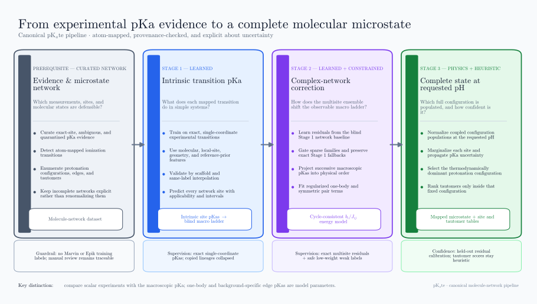

# Canonical protonation pipeline: detailed guide

This document explains the current canonical molecule-network pipeline from
curated experimental pKa evidence to a complete predicted molecular microstate
at a requested pH. It describes the active Stage 1, Stage 2, and Stage 3 code.
The older candidate-table pipeline is not part of this workflow.

For the shorter file-to-stage index, see [`PIPELINE_STAGE_MAP.md`](PIPELINE_STAGE_MAP.md).
For the molecule-network CSV schema, see
[`README_molecule_microstate_network_dataset.md`](README_molecule_microstate_network_dataset.md).



Regenerate the figure with:

```bash
python scripts/render_pipeline_overview.py
```

## 1. What the pipeline predicts

For each molecule and requested pH, the intended result is:

- a complete set of enumerated protonation configurations;
- a normalized population for every configuration;
- a marginal protonated probability and acid/base-form call for every detected
  ionization transition;
- confidence and applicability diagnostics for every site call;
- a thermodynamically dominant protonation configuration;
- a selected atom-mapped tautomer inside that configuration; and
- the full ranked tautomer candidate table, rather than only the winning drawing.

The central separation is:

1. **Stage 1 learns intrinsic transition behavior** from chemically simple,
   single-coordinate examples.
2. **Stage 2 learns how a complex molecular network changes the observable
   macroscopic pKa ladder**, then represents that ladder with one
   cycle-consistent free-energy model.
3. **Stage 3 evaluates that free-energy model at a requested pH** to obtain
   complete-state populations, site marginals, confidence, and a final
   tautomer-resolved structure.

Stage 3 does not train another pKa model. Tautomer ranking also does not feed
back into protonation thermodynamics.

## 2. Essential terminology

### Site or transition

A site is an acid/base transition associated with mapped atoms, for example
carboxylic acid/carboxylate or pyridinium/pyridine. A site has an acid form, a
base form, a functional-group label, a family, and one or more center atom maps.

In an amphoteric heterocycle, two pKas can describe two serial transitions of
one physical coordinate: cation to neutral and neutral to anion. These are two
transition records, but they must not be treated as two independent Boolean
sites.

### Protonation coordinate

A coordinate is the physical degree of freedom being protonated or
deprotonated. Ordinary sites are two-level coordinates. Supported amphoteric
rings use a three-level coordinate such as `anion < neutral < cation`.

### Protonation configuration

A configuration specifies the level or acid/base side of every protonation
coordinate. It is independent of which tautomer drawing is used to depict that
same charge/protonation configuration.

### Tautomer

A tautomer is an atom/bond/proton-location drawing within a fixed protonation
configuration. Multiple tautomer drawings must not gain extra thermodynamic
weight merely because more drawings were enumerated.

### The pKa quantities are not interchangeable

| Quantity | Meaning | Appropriate use |
|---|---|---|
| `stage1_intrinsic_pka` | Stage 1 estimate for an individual transition before complex-network correction | Local starting value and Stage 1 applicability audit |
| `stage1_network_macro_pka` | Macroscopic step produced by the enumerated network using only Stage 1 values | Blind Stage 2 baseline |
| `stage2_predicted_macro_pka` | Context-corrected, site-associated macroscopic pKa | Primary comparison with a scalar experimental pKa |
| `stage3_reconstructed_macro_pka` | Macro pKa implied by the emitted Stage 2 free-energy model | Closure/reconstruction check |
| `stage3_one_body_pka` | One-body coefficient in the pairwise free-energy model | Model parameter; not generally an observable multisite pKa |
| `stage3_contextual_edge_pka_*` | Microscopic transition pKa with the other coordinates fixed | Background-specific microscopic interpretation |

The compatibility field `stage3_effective_local_pka` is only an alias of
`stage3_one_body_pka`. It is not a separately measured or inferred observable.

## 3. End-to-end data flow

```text
raw SDF/CSV evidence + manual review overlays
                    |
                    v
       transition-level release dataset
                    |
                    v
 atom-mapped molecule microstate networks
      |                             |
      | single-coordinate rows      | all detected network sites
      v                             v
 Stage 1 training ----------> blind intrinsic site pKas
                                      |
                                      v
                          binding-polynomial baseline
                                      |
                  exact/weak experimental macro evidence
                                      |
                                      v
                  Stage 2 macro residual correction
                                      |
                                      v
               cycle-consistent pairwise energy model
                                      |
                               requested pH
                                      |
                                      v
              Stage 3 populations and site marginals
                                      |
                                      v
             tautomer ranking inside dominant config
```

The network dataset is the contract between the stages. It keeps experimental
anchors, predictions, site definitions, nodes, and edges in separate fields so
an experimental value cannot silently become an input feature.

## 4. Prerequisite: evidence curation and network construction

Although it precedes the three learned/inference stages, this step determines
whether their targets and state spaces are meaningful.

### 4.1 Release dataset

`build_release_microstate_dataset.py` normalizes the raw experimental sources
and applies the persistent manual review overlays. It preserves the original,
supplied, canonicalized, and generated structures separately. Review decisions
can confirm or reassign a transition, replace a structure, exclude a
structure-pKa pair, or quarantine an unresolved transition definition.

Experimental evidence is divided into:

- **exact-site evidence**: the pKa has a defensible association with a specific
  enumerated transition;
- **ambiguous molecule-level evidence**: the scalar value belongs to the
  molecule, but its exact transition is not established; and
- **quarantined evidence**: inconsistent, structurally invalid, out of range,
  or otherwise unsafe for supervision.

A manual atom selection establishes the structural transition used by the
project. It does not retroactively turn a source that reported only a
molecule-level pKa into independently atom-resolved experimental evidence.

Marvin and Epik values are prohibited as training labels in the canonical
pipeline. Their use flags are checked at stage boundaries.

### 4.2 Molecule network

`build_molecule_microstate_network_dataset.py` groups transition records by
stereochemistry-aware molecular identity and detects every supported ionizable
site. It then creates:

- `sites_json`: transition identities, mapped centers, Stage 1 results, and
  experimental evidence;
- `microstate_nodes_json`: atom-mapped protonation configurations and their
  tautomer drawings;
- `microstate_edges_json`: one-proton acid/base transitions; and
- `baseline_macro_pka_steps_json`: the blind Stage 1 macroscopic ladder.

Each edge must change one transition and one net proton. Serial amphoteric
transitions share a multilevel coordinate, preventing fictitious combinations
such as simultaneously treating a ring's cation/neutral and neutral/anion
steps as independent sites.

Truncation and missing edges are recorded explicitly. A partial network is
never treated as a complete molecular ensemble downstream.

## 5. Stage 1: intrinsic transition pKa

### 5.1 Purpose

Stage 1 answers:

> Given this molecular structure and this particular mapped functional-group
> transition, what pKa would be expected before explicitly modeling competition
> and coupling with other ionization coordinates?

It learns transferable site chemistry from single-coordinate molecules. The
whole molecular environment is still visible through descriptors and
fingerprints, so “intrinsic” does not mean an isolated textbook fragment. It
means that supervision is restricted to systems where one physical
protonation coordinate can be assigned without a multisite macro/micro
ambiguity.

Active files:

- `stage1_canonical_data.py`: builds the canonical training table;
- `stage1_train_intrinsic_pka.py`: selects, validates, and fits the model;
- `stage1_network_inference.py`: validates the bundle and predicts network sites;
- `train_intrinsic_single_group_model.py`: shared feature implementation; and
- `reference_residual_model.py`: learns residuals around chemistry priors.

### 5.2 Training-row eligibility

Stage 1 begins from the molecule-network dataset and keeps a transition only
when:

- the molecule contains one physical protonation coordinate;
- that transition has eligible exact-site experimental evidence;
- the network is complete and not truncated;
- no competing unresolved ionizable context was detected;
- the target lies inside the configured supported pKa range; and
- independent replicate values do not exceed the allowed disagreement range.

For a serial amphoteric coordinate, both measured edges may supervise Stage 1
because they are distinct transitions on one physical coordinate. An
unmeasured sibling edge is not assigned the measured value and receives no
manufactured target.

Copied scalar values without independent source lineage are collapsed rather
than counted as replicate confirmation. The accepted target is the median of
the independent eligible measurements. Its sample weight increases
sublinearly with replicate support and decreases with dispersion, uncertain
site mapping, and weaker evidence tier.

Rejected rows are written with an explicit quarantine reason rather than being
silently dropped.

### 5.3 Features

Stage 1 features include:

- whole-molecule RDKit descriptors and Morgan fingerprint;
- functional-group label and acidic/basic transition type;
- site-local atom counts, charge, aromaticity, ring, and heteroatom context;
- nearby functional-group counts;
- local-fragment descriptors and fingerprint;
- molecular and site geometry when 3D embedding succeeds; and
- a transition-specific reference pKa, its uncertainty, and a presence flag.

The model never receives `experimental_anchor_pka`, an experimental pKa
aggregate, or a target-derived feature at inference.

### 5.4 Model selection and validation

The candidate set contains regularized tree and histogram regressors wrapped as
reference-residual models. Model selection uses scaffold-grouped splits. The
one-standard-error rule prefers a simpler, more regularized model when several
candidates are statistically indistinguishable.

Three different diagnostics must not be conflated:

- **training reconstruction** checks whether the final fit can represent the
  training rows; it is not a generalization estimate;
- **same-label interpolation OOF** holds out molecules while retaining
  same-label analogues where counts permit; and
- **scaffold OOF** holds out Murcko scaffolds and can also expose exact-label
  zero-shot cases.

After validation, the deployable estimator is refitted on all eligible Stage 1
rows. The serialized bundle records that full-refit fact, feature columns,
detector versions, data hashes, validation errors, and calibration by family
and exact label.

### 5.5 Inference and applicability

Every detected network transition receives a blind Stage 1 estimate. Each
prediction also records:

- exact-label training-row count;
- nearest same-label fingerprint similarity;
- interpolation versus extrapolation/zero-shot status;
- a label-specific prediction interval; and
- whether the group feature was present in the fitted feature schema.

If an exact transition label is absent from training but has an enabled,
transition-specific reference prior, deployment uses that prior as an explicit
zero-shot fallback. The cross-family model estimate remains stored for audit.

### 5.6 Stage 1 output and limitation

The fitted model is:

`data/processed/ml_models_experimental_only/stage1_intrinsic/stage1_intrinsic_model.pkl`

Its predictions are embedded in the network dataset as
`stage1_intrinsic_pka`. Stage 1 is expected to perform best for chemistry close
to its exact-label training support. It does not by itself determine which
transition a lone ambiguous multisite experimental value belongs to, nor does
it learn site-site coupling from single-coordinate examples.

## 6. Thermodynamic baseline between Stages 1 and 2

The network builder converts all Stage 1 local values into a blind macroscopic
ladder before Stage 2 is trained. This is deterministic thermodynamics, not a
second learned model.

For independent binary coordinates with local pKas `p_i`, the binding
polynomial is equivalent to:

```text
product_i (1 + 10^p_i [H+])
```

The log ratio of adjacent proton-count coefficients gives each predicted
macroscopic pKa. The enumerated-coordinate implementation generalizes this to
serial multilevel coordinates and deduplicates tautomeric drawings at the
configuration level.

This baseline already includes the statistical competition among protonation
configurations. Therefore Stage 2 learns what remains after the known network
topology and Stage 1 estimates have been accounted for.

## 7. Stage 2: complex-network macroscopic correction

### 7.1 Purpose and target

Stage 2 answers:

> How should the blind Stage 1/network macroscopic ladder change in a complex
> multisite molecule, given its other sites and molecular context?

Its supervised target is:

```text
experimental site-associated macroscopic pKa
    - blind Stage 1 network macroscopic pKa
```

It is a residual model, not a replacement for Stage 1. The scalar target is
still macroscopic: even when review identifies the affected functional group,
the measured step can include the whole molecular ensemble.

Active files:

- `stage2_network_context.py`: row construction and features;
- `stage2_train_network_context.py`: training and held-out evaluation;
- `stage2_apply_network_context.py`: deployment and ladder projection; and
- `stage2_free_energy_coupling.py`: cycle-consistent energy closure.

### 7.2 Site-context features

One row is built per site in a complete multisite network. Features include:

- the Stage 1 intrinsic value and blind network macro value;
- the Stage 1 intrinsic-to-macro statistical shift;
- macro-step position and network/site sizes;
- other-site Stage 1 pKa distribution, closest gap, higher/lower counts, and a
  log-sum competition term;
- counts of the other functional-group families;
- graph distances and, when embedding succeeds, 3D distances between site
  centers and to the molecular centroid;
- whole-molecule descriptors and Morgan fingerprint; and
- site label and family indicators.

All `experimental_*` columns, targets, and sample weights are explicitly
excluded from the feature matrix.

### 7.3 Exact and ambiguous supervision

Exact-site anchors train the model, determine family support, drive model
selection, and are the only rows used for reported validation.

An ambiguous molecule-level pKa can be used only when the candidate network is
complete. Its supervision is marginalized across candidate sites according to
their distance from the blind Stage 1 macro prediction. All candidates for one
measurement share a small fixed total weight. These weak rows may improve the
final deployment fit, but they cannot unlock a family, select the model, or
enter the reported held-out metrics.

If an ionizable context is unresolved or the network is incomplete, the weak
measurement is written to `weak_molecule_blocked.csv`. Guessing a site from an
incomplete candidate set would turn ambiguity into a false exact label.

### 7.4 Model selection and family support

Candidate residual regressors are evaluated on scaffold-grouped splits. Every
held-out molecule is evaluated as a complete network, including unmeasured
sites, so validation performs the same family gating, ladder projection, and
free-energy closure used in deployment.

By default, a family needs at least 50 exact training rows before its learned
correction is enabled. `guanidine_like` and `phenol_phenolate` are explicit
priority families and are enabled with their available nonzero exact support.
Unsupported families fall back exactly to the Stage 1/network macro value. The
raw residual prediction is retained for audit even when the gate blocks it.

### 7.5 From corrected macro ladder to one energy function

Raw supported predictions can violate the physical ordering of successive
macroscopic pKas. Stage 2 projects adjustable entries onto a non-increasing
ladder while holding unsupported Stage 1 fallback entries fixed.

It then fits the minimum-complexity pairwise state-energy representation:

```text
log10 weight(x; pH)
    = sum_i b_i x_i + sum_(i<j) J_ij x_i x_j - nH(x) pH
```

where:

- `x_i = 1` means transition `i` is on its protonated/acid-form side;
- `b_i` is a one-body pKa-like coefficient;
- `J_ij` is a symmetric pair coupling in log10-equilibrium units; and
- `nH(x)` is the proton count of the configuration.

The contextual microscopic pKa for site `i` in a fixed background is:

```text
b_i + sum_j J_ij x_j
```

A positive `J_ij` stabilizes joint protonation. The reported interaction free
energy convention is `delta G = -R T ln(10) J_ij` at 298.15 K.

One-body refinements and pair terms are optimized jointly to reproduce the
projected Stage 2 macro ladder while remaining near the Stage 1 plus supported
Stage 2 proposal. Ridge penalties prefer small changes and small couplings.
Every edge pKa is derived from this one function, so reciprocal background
effects are symmetric and all cycles close.

### 7.6 Identifiability warning

A macroscopic pKa ladder usually does not uniquely determine every one-body and
pair parameter. The emitted pair terms are a regularized closure of the model's
macro prediction, not directly measured site-site interaction energies.

The output records optimizer status, reconstruction error, parameter count,
local Jacobian rank/nullity, observed-anchor count, active couplings, and an
explicit `regularized_prior_dependent...` identifiability label. Stage 3 uses
that label as a confidence penalty.

### 7.7 Stage 2 outputs

The trained model is:

`data/processed/ml_models_experimental_only/stage2_network_context/stage2_network_context_model.pkl`

The applied network is:

`data/processed/pka_molecule_microstate_network_stage2_predictions.csv`

Each molecule contains the corrected macro steps, one-body terms, pair
couplings, contextual edge pKas, uncertainty intervals, closure diagnostics,
and Stage 1/2 provenance hashes.

## 8. Stage 3: complete microstate inference

### 8.1 Purpose

Stage 3 answers:

> At this pH, what complete protonation configurations are populated, what is
> each site's marginal protonation state, and which mapped tautomer should be
> used to display the dominant configuration?

Active files:

- `stage3_apply_microstate_inference.py`: canonical application and outputs;
- `stage3_empirical_calibration.py`: held-out pKa-side calibration;
- `stage3_tautomer_ranking.py`: within-configuration tautomer enumeration and
  ranking; and
- `stage3_microstate_thermodynamics.py`: schema and compatibility helpers.

### 8.2 Provenance validation

Before computing populations, Stage 3 verifies:

- required network columns and unique molecule identifiers;
- no Marvin or Epik training provenance;
- the exact Stage 2 model hash referenced by the applied network;
- matching Stage 1 and Stage 2 schema/model provenance; and
- the expected pairwise free-energy schema and method.

The preferred runner, `run_canonical_protonation_pipeline.py`, executes Stage 2
and Stage 3 together and writes a manifest containing hashes of the network,
model, intermediate CSV, final tables, calibration, metrics, and schema.

### 8.3 Configuration populations

For every complete enumerated configuration, Stage 3 evaluates the Stage 2
energy function at the requested pH. It subtracts the maximum log weight before
exponentiation, normalizes over configurations, and assigns thermodynamic
weight once per unique configuration.

If several nodes are merely tautomer drawings of the same configuration, the
configuration population is not multiplied by their count. Node-level values
are initially divided across equivalent drawings for bookkeeping; final
tautomer resolution is performed separately.

Stage 3 reports the dominant and second configuration populations, their gap,
configuration entropy, effective configuration count, and normalization sum.

For an incomplete or truncated network, Stage 3 does not renormalize the
available subset. Population, dominant-state, and marginal outputs are marked
unavailable while every detected site is retained for audit.

### 8.4 Site marginals and state calls

The protonated probability for a site is the sum of all configuration
populations on that transition's acid-form side. Serial coordinates use their
coordinate level, including states outside the immediate edge, rather than
assuming every transition is an independent binary variable.

The site call is:

- `acid_form` when the coupled protonated probability is at least 0.5;
- `base_form` when it is below 0.5; or
- `unavailable` for an incomplete network.

Stage 3 also computes uncoupled marginals with pair terms removed and flags any
site or dominant microstate whose call changes because of the inferred
coupling.

### 8.5 Uncertainty and confidence

Stage 2 macro intervals are propagated to one-body sensitivity intervals. The
site's one-body term is moved to the lower and upper limits, the full coupled
population is recomputed, and the resulting protonated-probability interval is
stored.

Important confidence fields are:

- `stage3_site_state_decision_confidence`: distance of the point probability
  from 0.5;
- `stage3_uncertainty_aware_site_state_confidence`: nonzero only when the full
  probability interval stays on one side of 0.5;
- `stage3_empirical_pka_side_call_confidence`: probability that a scalar
  observed pKa would fall on the side of the requested pH supporting the call;
  and
- `stage3_overall_site_state_confidence`: conservative product of empirical
  centered evidence, population decisiveness, Stage 1 applicability,
  free-energy reconstruction quality, and pair-identifiability factors.

The empirical component uses signed residuals from Stage 1 scaffold OOF and
Stage 2 scaffold holdout. Sparse exact-label residual distributions shrink to
family and then global distributions. This is calibration of the scalar-pKa
side of the call, not direct validation against measured microstate
populations.

Overall confidence tiers are `high` at 0.70 or above, `medium` at 0.40, `low`
at 0.10, and `very_low` below 0.10. A low value can therefore reflect sparse
Stage 1 chemistry, an interval crossing 50%, weak population separation,
macro-ladder reconstruction error, or prior-dependent pair couplings rather
than a single generic failure.

### 8.6 Tautomer enumeration and final structure

Protonation and tautomer selection occur in this order:

1. choose the dominant protonation configuration from the free-energy model;
2. collect every equivalent node seed for that fixed configuration;
3. enumerate RDKit tautomers from all seeds;
4. reject charge-changing candidates and sanitize the remainder;
5. deduplicate atom-mapped candidates across seeds;
6. score candidates with RDKit's tautomer rule score;
7. retain the configured number per configuration, currently 16 by default;
8. choose rank 1 only inside the already-selected dominant configuration.

The normalized tautomer weights are a softmax of RDKit rule-score differences
with a configurable score scale. They are heuristic ranking weights
conditional on the retained candidate set. They are not solution-phase free
energies or calibrated tautomer populations.

Enumeration failures, charge inconsistencies, RDKit search limits, tied top
scores, and the final per-configuration cap are all reported. A tautomer
heuristic is never allowed to select a lower-population protonation
configuration.

### 8.7 Stage 3 outputs

The principal artifacts are:

- `data/processed/pka_molecule_microstate_network_stage3_predictions.csv`:
  one row per molecule with the populated network and selected complete state;
- `data/processed/ml_models_experimental_only/stage3_microstates/stage3_site_predictions.csv`:
  one row per site with macro, one-body, contextual, marginal, and confidence
  fields;
- `data/processed/ml_models_experimental_only/stage3_microstates/stage3_ranked_tautomers.csv`:
  one row per retained tautomer candidate;
- `stage3_empirical_call_calibration.json`: reproducible residual calibration;
- `stage3_output_schema.json`: field semantics; and
- `canonical_pipeline_run_manifest.json`: end-to-end artifact hashes.

## 9. What is learned, derived, and heuristic

| Component | Category | Evidence/assumption |
|---|---|---|
| Stage 1 intrinsic pKa | Learned | Exact-site, single-coordinate experimental targets plus disclosed reference priors |
| Stage 1 network macro ladder | Deterministic thermodynamics | Enumerated coordinate topology and Stage 1 predictions |
| Stage 2 residual correction | Learned | Exact multisite anchors; weak complete-network evidence only in final low-weight fit |
| Stage 2 ladder projection | Deterministic constraint | Successive macro pKas must be non-increasing |
| Stage 2 pair terms | Regularized derived closure | Chosen to reproduce the predicted macro ladder; generally not identifiable measurements |
| Stage 3 configuration populations | Thermodynamic evaluation | Stage 2 energy function at the requested pH |
| Stage 3 empirical pKa-side confidence | Held-out residual calibration | Proxy for whether scalar pKa supports the predicted side |
| Stage 3 tautomer rank | Heuristic | RDKit rules within a fixed protonation configuration |

## 10. Rebuild and inference workflows

### Full rebuild after data, site definitions, or detector changes

```bash
python scripts/build_release_microstate_dataset.py

# Refresh topology and anchors using the currently installed Stage 1 bundle.
python scripts/build_molecule_microstate_network_dataset.py \
  --allow-stage1-detector-mismatch

python scripts/stage1_train_intrinsic_pka.py \
  --network-dataset data/processed/pka_molecule_microstate_network_dataset.csv \
  --out-dir data/processed/ml_models_experimental_only/stage1_intrinsic

# Re-score every site with the new Stage 1 model.
python scripts/build_molecule_microstate_network_dataset.py

python scripts/stage2_train_network_context.py
python scripts/run_canonical_protonation_pipeline.py --ph 7.4
python scripts/visualize_canonical_stage3_failures.py
python scripts/audit_pka_evidence_quality.py
```

The two network builds around Stage 1 training are intentional. Stage 1
training rows come from the network definitions, while the final network must
contain predictions from the newly fitted Stage 1 model.

### Inference for a new molecule

`pkate.predict()` is the deployment entry point for a SMILES that is not
already present in the molecule-network dataset:

```python
from pkate import predict

result = predict("NCCCC(=O)O", ph=7.4)
```

The function detects and maps the query's sites, constructs its protonation
network, applies Stage 1 to every transition, permits Stage 2 inference only
after model/schema/detector compatibility checks, and then runs the unchanged
Stage 3 population and tautomer machinery. The query contributes no training
or experimental label. `python -m pkate SMILES --ph 7.4` exposes the same path
as JSON; `--output-dir` retains its full intermediate network and audit files.

A query with no transition covered by the current detector policy is returned
unchanged with status `no_supported_ionizable_sites_detected`. An incomplete
enumerated network remains unavailable under the same rule as dataset-wide
inference; the API does not normalize a partial state space.

### Routine inference over the prepared molecule dataset

```bash
python scripts/run_canonical_protonation_pipeline.py --ph 7.4
```

The runner applies Stage 2 to the current Stage 1-scored network and then runs
Stage 3 on that exact intermediate. Stage 1 is not rerun by this command because
its blind predictions are already embedded in the network dataset.

For a Stage-3-only implementation change, `--reuse-stage2-output` is permitted
only when the previous manifest proves that the existing network, Stage 2
model, and Stage 2 output hashes match exactly.

## 11. Interpretation guardrails

- Compare scalar experimental pKas with `stage2_predicted_macro_pka` or the
  Stage 3 reconstructed macro value, not automatically with a one-body or
  contextual edge coefficient.
- A correct atom-mapped site assignment does not prove that the original source
  measured a microstate-resolved transition.
- A lone value in a multisite molecule constrains one observed macro step; it
  does not uniquely reveal every microscopic transition or pair interaction.
- Stage 1 zero-shot fallback is disclosed prior use, not new experimental
  support for that exact transition.
- Stage 2 pair couplings can be physically useful for a consistent downstream
  ensemble while still being individually underdetermined.
- Stage 3 pKa-side confidence is not direct experimental microstate accuracy.
- RDKit tautomer weights are not Boltzmann populations.
- Incomplete networks must remain unavailable rather than be normalized over a
  convenient subset.
- Post-hoc secondary-transition suggestions are review aids only. They do not
  overwrite curated assignments or become training labels automatically.

## 12. Review and diagnostics

Run:

```bash
python scripts/visualize_canonical_stage3_failures.py
```

The generated review index separates measured-label errors from deployment and
applicability diagnostics. Its queues cover held-out pKa errors, possible
secondary-transition assignments, low-confidence calls, empirical pKa-side
conflicts, free-energy reconstruction gaps, coupling-changed calls, and
incomplete networks.

The categories should not all be called “prediction failures.” Only the
held-out pKa queue is directly an error against a measured label. The other
queues identify assumptions, uncertainty, or model-applicability limits that
may warrant chemical review.
